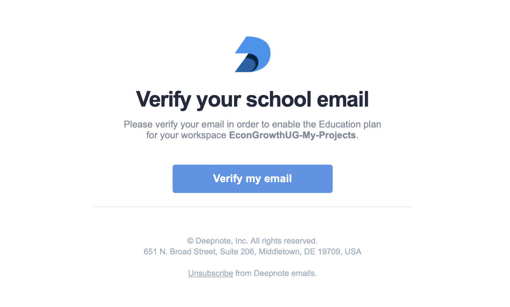

Title: Create Deepnote Account
Slug: Create Deepnote Account
Category: Computation, Dynamic Programming, IPythonmain
date: 2016-12-29 13:53
Tags: Computation, IPython, Python, QGIS
Author: Ömer Özak

[Deepnote](https://deepnote.com/) is a (free) online computational notebook service.

# Step-by-step guide
--

1.  Head over to [Deepnote](https://deepnote.com/) and click on [Get Started](https://deepnote.com/sign-up). 
 
     
      
    
2.  Click. on Sign up with email.  

      
      
    
3.  Sign up using your email address. Make sure to follow the instructions and prove you are a human!

<b>Tip:</b> You can use your GMAIL  (Recommended) or personal email account. Then use your institutional <b>.EDU<b/> email account to verify your educational status (Select Education in the next screen) and get the free tools and account upgrades (See section after step 9). The only difference (as far as I can tell) is how you log in.

  

           
    
4.  The system will send you an email to verify your account. Open your email inbox and click on the "Sign in now" image/button in the email from Deepnote. If you did not get one, check your Junk Mail Folder.  

      
      
    
5.  Fill out your personal information to be used with the account  

      

6. Use **EconGrowthUG-My-Projects** as the name of your workspace.

      

7. Next, you could invite Teammates if you wanted, but for now, let's not invite anyone, and continue to the next step.

      

8. Next, it will give you the option of linking your workspace with a data source. Do not choose anything for now and continue to the next step.

      

9. If you did all steps correctly, you should see a Welcome to Deepnote message (with your name), and on the left, you should see the name of the workspace **EconGrowthUG-My-Projects**.

      

10. Now, let's change some settings in your workspace. Click on **Settings and Members**.

      

11. You should now see the current settings of your workspace.

      

12. Click on **Allow projects to be shared publically** and on **Allow apps to be shared publically**. Their buttons should become active now.

      

You should be all set to start using Deepnote. To log in, you will use your **.EDU** email and use the link you get in your mail's inbox. No passwords or anything (so far). 

# Upgrade to Education Plan      
--
    
If you created your account with an **.EDU** email you already have educational benefits. If you did not use an **.EDU** email, e.g., you used yoru personal email account, you will need to request educational benefits as explained below.

1.  Click on **Billing & usage**.  

      
      
    
2.  Click on **Change plan**.  

      
      
    
3.  Now, you should be on the **Upgrade** page. Click on **Upgrade to Education**.  

      
      
    
4.  Use your YOUREMAIL@SMU.EDU to fill out the required information.  

      
      
    
5.  The system will send you another verification email. Click on **Verify my email**.  

      
      
    
6.  Now, you should see a **Welcome to Education Plan** message.  

      

If you want to find out more about the [Educational Plan](https://deepnote.com/docs/edu-verification) or have issues, check out their [information website](https://deepnote.com/docs/edu-verification).  You can also chat with them if you need support or ask questions in their [community forum](https://community.deepnote.com/home).

# Add EconGrowthUG Workspace to your Deepnote account
--
You can use all the notebooks on this website on Deepnote, by adding the [EconGrowthUG Workspace](https://deepnote.com/join-team?token=ef886be7ae3045c) to your account. You will not have editing privileges, but you will be able to copy notebooks to your **EconGrowthUG-My-Projects** Workspace, where you can edit and run code.

1. Log into your [Deepnote](https://deepnote.com/) account.
2. Follow [this link to the EconGrowthUG workspace](https://deepnote.com/join-team?token=ef886be7ae3045c).
3. Once you do this, you will be a Contributor to the course's workspace, i.e., you can view and run code I have prepared for you. Moreover, and more importantly, you can copy projects into your own workspace. If all went you should see two workspaces in your account.

       
